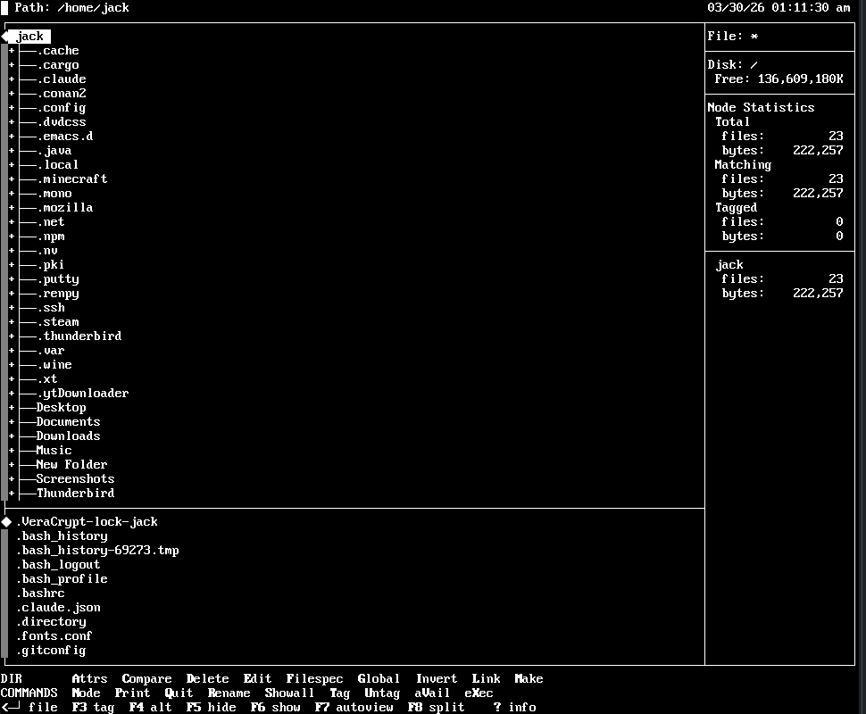

# UnixTree

A curses-based file manager for Unix/Linux, modelled on the classic XTreeGold from DOS. Three-panel interface — directory tree (upper left), disk and node statistics (upper right), file list (lower) — controlled entirely from the keyboard.

This is a fork of [dokakod/unixtree](https://github.com/dokakod/unixtree), preserving the original source by **Rob Juergens**.



---

## Installation

Pre-built packages are on the [Releases](https://github.com/Retro-Jack/UnixTree/releases) page.

| Distro | Command |
|--------|---------|
| Arch / Manjaro | `sudo pacman -U unixtree-3.0.2-*.pkg.tar.zst` |
| Debian / Ubuntu / Mint | `sudo dpkg -i unixtree_3.0.2-1_amd64.deb` |
| Fedora / RHEL | `sudo dnf install ./unixtree-3.0.2-1.x86_64.rpm` |
| Generic Linux | `tar xzf unixtree-3.0.2-linux-x86_64.tar.gz && sudo ./install.sh` |

```sh
xt     # launch
xtx    # X11 variant
```

If `xt` fails to start, see [Terminal Requirements](https://github.com/Retro-Jack/UnixTree/wiki/Terminal-Requirements).

---

## Documentation

Full documentation is in the [wiki](https://github.com/Retro-Jack/UnixTree/wiki):

- [Installation](https://github.com/Retro-Jack/UnixTree/wiki/Installation)
- [Terminal Requirements](https://github.com/Retro-Jack/UnixTree/wiki/Terminal-Requirements)
- [Building from Source](https://github.com/Retro-Jack/UnixTree/wiki/Building-from-Source)
- [Command Reference](https://github.com/Retro-Jack/UnixTree/wiki/Command-Reference)
- [Keyboard Reference](https://github.com/Retro-Jack/UnixTree/wiki/Keyboard-Reference)
- [Patches Applied](https://github.com/Retro-Jack/UnixTree/wiki/Patches-Applied)

---

## License

GPL — see [COPYING](COPYING).

Bundled third-party code carries its own licence:
- **libgzip** — zlib licence (Jean-loup Gailly & Mark Adler)
- **libmagic** — BSD (Ian F. Darwin)
- **libdiff** — GPL (various authors)
- **libutils** — regexp code by Henry Spencer
- **libform / libmenu** — Juergen Pfeifer
- **libpanel** — Zeyd M. Ben-Halim & Eric S. Raymond
- **libxpm** — XFree86
